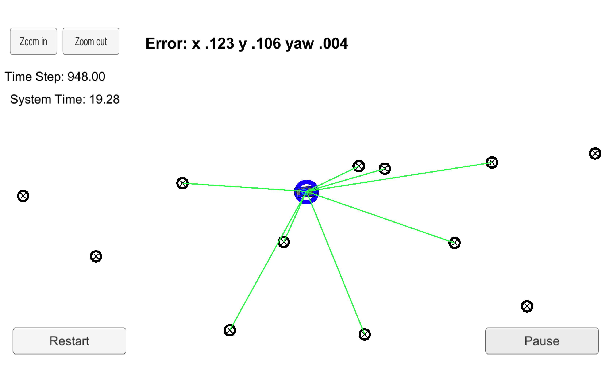

# Kidnapped vehicle 

### overview

particle filter are the relaisation of bayes filter or markov localisation filter, which is used to solve the problem of localisation
the project consist of

    1) Initialisation step
    2) Prediction step
    3) Data Association step
    4) Update update Weights
    5) Resampling
    6) Get Associations
    7) Set Associations
    8) get Sense Y

#### Implementation Process

##### Particle Filters implementation

~ Particle filters has got four major steps:
>Initialisation step: At the initialization step we estimate our position from GPS input. The subsequent steps in the process will refine this estimate to localize our vehicle.

>Prediction step: During the prediction step we add the control input (yaw rate & velocity) for all particles.

>Update step: During the update step, we update our particle weights using map landmark positions and feature measurements.

>Resample step: During resampling we will resample M times (M is range of 0 to length_of_particleArray) drawing a particle i (i is the particle index) proportional to its weight . Resampling wheel is used at this step.

### Cimpiling and exuting the project  image display

